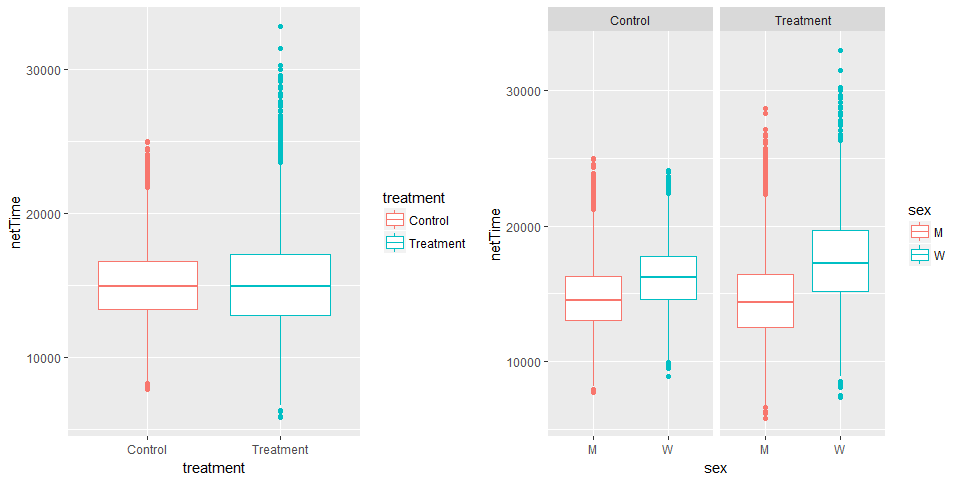
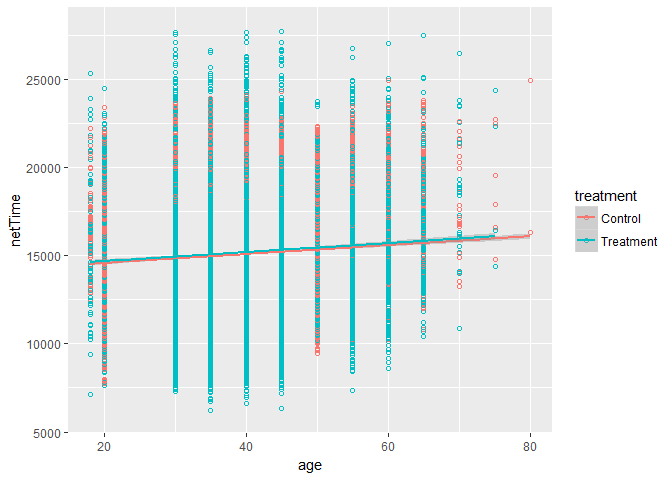
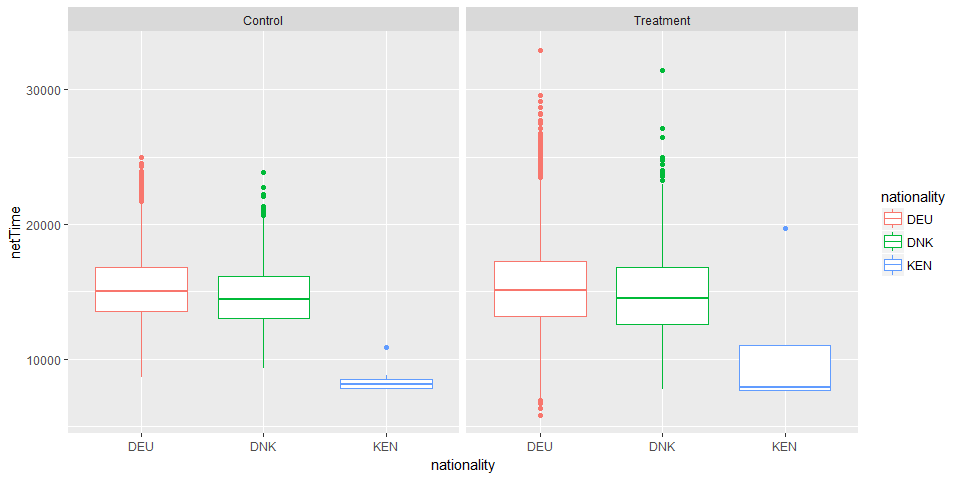
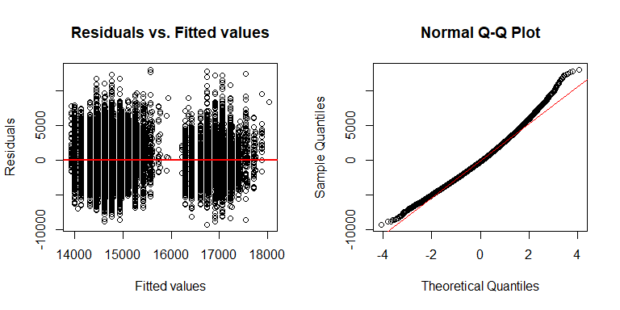

## Introduction

The shoe manufacturer ShoeCo Inc. wants to understand if their newest shoe, the RunPro 3000,
makes runners faster. In the context of a marathon, they provide 50% of the runners with a free pair of RunPro 3000 on the condition that they wear the shoes during the race.

Statistics are collected on the runners running with a pair of RunPro 3000 and runners running with their usual shoes in order to analyse whether the shoes actually make a difference on their performance. More specifically: 

* Does wearing a pair of RunPro 3000 have a statistically significant impact on runners' performance?
* If so, is the impact on performance the same for all runners?
* Can we use the runners' attributes (including whether or not they are wearing a pair of RunPro 3000) to predict how quickly they will finish the marathon?

## Reading and combining the data

### Reading the data

We read the data and have a first look into it.

```r
runners <- read.csv("runner_attributes.csv")
times <- read.csv("marathon_times.csv")
```


```r
str(runners)
```

```
## 'data.frame':	30923 obs. of  5 variables:
##  $ ageClass   : Factor w/ 13 levels "20","30","35",..: 1 1 1 2 2 1 1 2 1 1 ...
##  $ sex        : Factor w/ 2 levels "M","W": 1 1 1 1 1 1 1 1 1 1 ...
##  $ nationality: Factor w/ 92 levels "AFG","AGO","AHO",..: 51 51 51 51 51 32 51 6 13 32 ...
##  $ treatment  : Factor w/ 2 levels "Control","Treatment": 2 2 1 1 2 2 1 1 1 1 ...
##  $ unique_id  : Factor w/ 29819 levels "000170029ab9e75e3bebec9e3c80c3431c758a80",..: 6083 3418 3441 2088 9544 11172 13019 1681 27560 20219 ...
```

The `runners` data set is a data frame with 30923 observations on 5 variables:

* `ageClass`: the decade (or at times half-decade) corresponding to the runner's age 
* `sex`: the runner's gender (*M* for man and *W* for woman)
* `nationality`: the runner's nationality (ISO alpha-3 code)
* `treatment`: whether the runner wears a pair of RunPro 3000 (*Treatment*) or not (*Control*)
* `unique_id`: the runner's unique ID.


```r
str(times)
```

```
## 'data.frame':	30373 obs. of  3 variables:
##  $ netTime  : int  7661 7737 7747 7750 8163 7811 7853 7902 7923 7927 ...
##  $ clockTime: int  7661 7737 7747 7750 8163 7811 7853 7902 7923 7927 ...
##  $ unique_id: Factor w/ 29819 levels "000170029ab9e75e3bebec9e3c80c3431c758a80",..: 6083 3418 3441 2088 9544 11172 13019 1681 27560 20219 ...
```

The `times` data set is a data frame with 30373 observations on 3 variables:

* `netTime`: the number of seconds between the runner’s race start and race
finish 
* `clockTime`: the marathon clock time in seconds (since the beginning of the race) at the time
of the runner’s race finish
* `unique_id`: the runner's unique ID.

The first observations, which we can make, are as follows: 

* In order to know the attributes of the particular runner achieving a certain time, we need to link the two data sets together (potentially with `unique_ID`).
* There are less observations in the `times` data set than in the `runners` data set. This is probably because the runners participating in this study did not all in the end participate in (or finish) the race.
* We are not interested in the `clockTime` variable as we are only interested in runners' performances, which is recorded with the `netTime` variable (time elapsed between the time the runner crosses the start and finish lines).

### Combining the data

The first problem we encounter is that `unique_id` is actually not unique.


```r
freq_id_runners <- table(runners$unique_id)
length(freq_id_runners[freq_id_runners>1]) # number of unique IDs with more than one occurence
```

```
## [1] 707
```

```r
freq_id_times <- table(times$unique_id)
length(freq_id_times[freq_id_times>1]) # number of unique IDs with more than one occurence
```

```
## [1] 443
```

```r
runners[runners$unique_id == "bcde089300b64521291d157c2148e80415058078",]
```

```
##       ageClass sex nationality treatment
## 6998        30   M         DEU Treatment
## 23446       30   M         DEU   Control
## 26637       30   M         DEU Treatment
## 28900       30   M         DEU   Control
##                                      unique_id
## 6998  bcde089300b64521291d157c2148e80415058078
## 23446 bcde089300b64521291d157c2148e80415058078
## 26637 bcde089300b64521291d157c2148e80415058078
## 28900 bcde089300b64521291d157c2148e80415058078
```

```r
times[times$unique_id == "bcde089300b64521291d157c2148e80415058078",]
```

```
##       netTime clockTime                                unique_id
## 6998    13413     13508 bcde089300b64521291d157c2148e80415058078
## 23446   16871     16980 bcde089300b64521291d157c2148e80415058078
## 26637   22527     22739 bcde089300b64521291d157c2148e80415058078
## 28900   19492     19534 bcde089300b64521291d157c2148e80415058078
```

It seems that `unique_id` indeed relates to a particular individual, however, this individual may at times be wearing the RunPro 3000 and at other times not. The multiple entries per runner are therefore not pure duplicates and it is therefore not possible to link times to inviduals based on `unique_id`.

Rows on rows, 'unique_id' seems however to match each other:


```r
matching_ids <- runners$unique_id[1:dim(times)[1]] == times$unique_id # We need to reduce the vector for runners to the number of rows in times
table(matching_ids)
```

```
## matching_ids
##  TRUE 
## 30373
```

`unique_id` is identical between the first 30373 rows of `runners` and the rows of `times`. We need to let go of the last 550 rows of `runners`, however, as we do not lose any information on performance, that is alright for the purpose of our analysis.

We therefore combine the two data sets with a simple bind:


```r
runners_with_times <- runners[1:dim(times)[1],-5] # Remove unique_id to avoid duplicated columns
runners_times <- cbind(runners_with_times, times)
```

## Cleaning and pre-processing the data

### Factor variables

#### Age


```r
table(runners_times$ageClass)
```

```
## 
##   20   30   35   40   45   50   55   60   65   70   75   80  U20 
## 3438 3859 5718 6744 4845 3066 1407  735  351   51   10    2  147
```

The variable age is a factor variable, however, it may be interesting to use it as a continuous variable for the purpose of our analysis as age is normally continuous. For the age category `U20` (under 20 years old), it is reasonable to assume that these runners should be at least 18 years old as there is probably an age limit for participating in a marathon.


```r
age <- as.numeric(levels(runners_times$ageClass))[runners_times$ageClass]
age[is.na(age)] <- 18 # U20 became NA
runners_times$age <- age
```

#### Other factor variables


```r
table(runners_times$sex)
```

```
## 
##     M     W 
## 24501  5872
```

```r
table(runners_times$nationality)
```

```
## 
##   AFG   AGO   AHO   ALB   ARG   AUS   AUT   BEL   BGR   BIH   BLR   BOL 
##     1     1     1     1     6    53   758   160     4     2     1     1 
##   BRA   CAN   CHE   CHL   CHN   COL   COM   CRI   CUB   CYP   CZE   DEU 
##    67    62   767     6     5     5     3    12     1     1    12 20909 
##   DNK   DOM   DZA   ECU   EGY   ESP   EST   ETH   FIN   FLK   FRA   GAN 
##  1873     1     4     4     1   251    41     7   325     1   756     1 
##   GBR   GHA   GRC   HRV   HUN   IDN   IND   IRL   IRN   ISI   ISL   ISR 
##   894     1    13     5    19     1     3    65     7     1    20    42 
##   ITA   JPN   KEN   KOR   KZK   LBN   LBR   LIE   LTU   LUX   LVA   MAR 
##   741   160    12    28     1     1     1    10     1    40     7     2 
##   MEX   MKO   MLI   MLT   MUS   NGA   NIC   NLD   NOR   NZL   PAK   PER 
##   100     2     1     5     1     1     1   906    95    29     2     8 
##   PHL   POL   PRI   PRT   ROU   RUS   SDN   SEN   SGP   SLV   SVK   SVN 
##     1   207     1    15     2    17     1     1     3     1     2    16 
##   SWE   THA   TUR   TWN   USA   VEN   YUG   ZAF 
##   279     4    33     3   343    49     2    63
```

```r
table(runners_times$treatment)
```

```
## 
##   Control Treatment 
##     15171     15202
```

The other variables are real categorical variables and look fine.

### Numeric variables

The only numeric variable of interest to us is the `netTime` variable.


```r
summary(runners_times$netTime)
```

```
##    Min. 1st Qu.  Median    Mean 3rd Qu.    Max. 
##   -1000   13115   14907   15113   16898   32942
```

```r
sum(is.na(runners_times$netTime))
```

```
## [1] 0
```

There are no missing values, however, some values are negative, which cannot be possible. We delete these records as they may negatively impact our analysis.


```r
runners_times <- runners_times[runners_times$netTime > 0,]
```

## Exploratory data analysis


```r
library(ggplot2)
library(gridExtra)
g1 <- ggplot(runners_times, aes(x=treatment, y=netTime, color=treatment)) + 
      geom_boxplot()
g2 <- ggplot(runners_times, aes(x=sex, y=netTime, color=sex)) + 
      geom_boxplot() + facet_grid(.~treatment)
grid.arrange(g1, g2, nrow = 1)
```

<!-- -->

First of all, it seems that wearing a pair of RunPro 3000 does not impact performance when ignoring other factors such as gender, age, etc. as the average `netTime` of the treatment group is about the same as the one of the control group.

Wearing a pair of RunPro 3000 also seems not to impact the performance of male runners, nevertheless, it seems that female runners are performing slightly worse when wearing a pair of RunPro 3000. As part of this second plot, one can also see that sex may be a driver of performance as men seem to generally perform better than women (shorter `netTime`).


```r
g3 <- ggplot(runners_times, aes(x=age, y=netTime, color=treatment)) + 
       geom_point(shape=1) + geom_smooth(method = "lm") + ylim(6000, 28000) 
g3
```

<!-- -->

In this third plot, it first looks like that, for some age categories, wearing a pair of RunPro 3000 positively affects performance (e.g. for ages ranging from 30 to 45). However the two corresponding fitted lines are almost superposed, rather indicating that there is no relationship. Age, on the other hand, seems to be a driver of performance as performance seems to generally decrease as age increases.


```r
runners_times_USAETH <- runners_times[runners_times$nationality == "DEU" | runners_times$nationality == "DNK" | runners_times$nationality == "KEN", ]
g4 <- ggplot(runners_times_USAETH, aes(x=nationality, y=netTime, color=nationality)) + 
      geom_boxplot() + facet_grid(.~treatment)
g4
```

<!-- -->

For plotting the impact of the RunPro 3000 shoes on performance according to nationality, it is difficult to represent all nationalities. We therefore select the German and Danish nationalities as these have the greatest number of participants. We also select Kenya as it is a known fact that Kenyan runners typically perform well at marathon races.

In this last plot, we see again that wearing a pair of RunPro 3000 does not seem to impact performance (positively or negatively). On the other hand, nationality may play some role as one can see that Kenyan runners generally perform better than German or Danish runners. We should however remain cautious of the significance of this observation as there are only 12 Kenyan runners for 20909 German runners.

## Hypothesis testing

We will perform a couple of t-tests in order to verify some of the observations made above:

* There is no difference in performance between runners wearing a pair of RunPro 3000 and runners not wearing a pair of RunPro 3000.
* There is a difference in performance between *female* runners wearing a pair of RunPro 3000 and *female* runners not wearing a pair of RunPro 3000.

For our t-tests, we need to make the following assumptions: 

* `netTime` is approximately normally distributed within the population of runners.
* Our sample is a simple random sample, i.e. the data is collected from a randomly selected portion of the total population of runners. Note: This assumption is probably not verified as the marathon is apparently taking place in Germany and that, as a consequence, other geographical provenances (and thus ethnic provenances) are under-represented.


```r
treatment <- runners_times[runners_times$treatment == "Treatment",]
control <- runners_times[runners_times$treatment == "Control",]
tTest1 <- t.test(treatment$netTime, control$netTime, paired = FALSE , var.equal = FALSE, conf.level = 0.95)
tTest1$p.value
```

```
## [1] 0.000265725
```

```r
tTest1$conf.int[1:2]
```

```
## [1]  56.17957 186.72299
```

Contrary to what we were assuming, there is a statistically significant difference (p-value < 0.05 and confidence interval excluding zero) in the mean of `netTime` for runners wearing a pair of RunPro 3000 and runners not wearing a pair of RunPro 3000, whereby it seems that **wearing a pair of RunPro 3000 negatively affects performance**. We note however that the impact seems to be rather minimal as the confidence interval is only 56.18 *seconds* above zero.


```r
treatment_w <- runners_times[runners_times$treatment == "Treatment" & runners_times$sex == "W",]
control_w <- runners_times[runners_times$treatment == "Control" & runners_times$sex == "W",]
tTest2 <- t.test(treatment_w$netTime, control_w$netTime, paired = FALSE , var.equal = FALSE, conf.level = 0.95)
tTest2$p.value
```

```
## [1] 8.731119e-58
```

```r
tTest2$conf.int[1:2]
```

```
## [1] 1064.314 1356.886
```

With this second t-test, we are showing that **the impact observed above is a lot stronger amongst female runners** with a much lower p-value and the lower end of our confidence interval being further away from zero (of about 18 minutes).

## Model fitting

As part of the above observations and analyses, we saw that the main drivers of performance seemed to be:

* Age: negatively related to performance (i.e. postively related to `netTime`)
* Being a female runner: negatively related to performance (i.e. postively related to `netTime`)
* Wearing a pair of RunPro 3000: negatively related to performance (i.e. postively related to `netTime`).

We can now fit a model to verify these relationships, but first need to isolate part of the data for testing purposes.


```r
library(caret)
set.seed(123)
in_training <- createDataPartition(y=runners_times$netTime, p=0.7, list = FALSE)
training <- runners_times[in_training,]
testing <- runners_times[-in_training,]
```

### Linear model including treatment but excluding nationality

We now fit a first model with the above three regressors.


```r
fit1 <- lm(netTime ~ age + sex + treatment, data = training)
summary(fit1)$coefficients
```

```
##                       Estimate Std. Error    t value     Pr(>|t|)
## (Intercept)        13342.88333  77.006559 173.269439 0.000000e+00
## age                   32.39734   1.829293  17.710305 1.106230e-69
## sexW                2303.58002  47.658450  48.335186 0.000000e+00
## treatmentTreatment   130.20912  37.555389   3.467122 5.271026e-04
```

This seems to be a first good model as all coefficients are statistically significant (p-values < 0.05). The value of the coefficients is also about what we were expecting:

* Being a female runner is what affects performance the most, whereby with `age` and `treatment` remaining constant, being a female runner increases `netTime` by about 38 minutes.
* Age plays a less important role than what one would typically expect (slope of only about 32 seconds)
* Wearing a pair of RunPro 3000 negatively affects performance but not by much (slope of only about 2 minutes).

In order to be able to validate the above inferences made on the slopes of our model, we should also perform some diagnostics on the residuals:


```r
par(mfrow=c(1,2))
plot(x=fitted(fit1), y=residuals(fit1), xlab="Fitted values", ylab="Residuals", main = "Residuals vs. Fitted values")
abline(0, 0, col="red", lwd=2)  
qqnorm(summary(fit1)$residuals)
qqline(summary(fit1)$residuals, col = "red")
```

<!-- -->

The above plots further confirm the validity of our model as: 

* By plotting residuals vs. fitted values, we see that residuals are spread fairly randomly around the 0 line indicating that the relationship between our outcome and our predictors is rather linear.
* By plotting a QQ-plot, we confirm that the error is fairly normally distributed (apart from the tails).

Lastly, we can test the prediction accuracy of our model against the `testing` data set.


```r
predicted_netTime <- predict(fit1, testing)
rmse <- RMSE(predicted_netTime, testing$netTime)
rmse
```

```
## [1] 2776.453
```

The root mean squared error amounts to 2776.45 seconds, which is about 46 minutes.

### Linear model including treatment and nationality

We can now try to also include the nationality to see if this improves our model.


```r
fit2 <- lm(netTime ~ age + sex + treatment + nationality, data = training)
summary(fit2)$coefficients
```

```
##                        Estimate Std. Error      t value     Pr(>|t|)
## (Intercept)        13373.298870 2710.85260  4.933244568 8.148796e-07
## age                   31.697825    1.83287 17.294093566 1.494250e-66
## sexW                2288.100280   47.39738 48.274823466 0.000000e+00
## treatmentTreatment   129.809891   37.21358  3.488240081 4.871982e-04
## nationalityAGO     -4090.722737 3831.44393 -1.067671304 2.856810e-01
## nationalityAHO      1996.277263 3831.44393  0.521024789 6.023550e-01
## nationalityALB       442.744635 3831.74110  0.115546594 9.080130e-01
## nationalityARG      2446.272884 2967.71109  0.824296170 4.097806e-01
## nationalityAUS     -1696.430273 2744.71617 -0.618071292 5.365350e-01
## nationalityAUT      -850.252068 2711.74923 -0.313543766 7.538707e-01
## nationalityBEL     -1232.602900 2721.92126 -0.452842968 6.506665e-01
## nationalityBGR     -1324.493821 3029.07564 -0.437260068 6.619272e-01
## nationalityBIH     -1048.783753 3318.35877 -0.316054961 7.519639e-01
## nationalityBLR      4586.978248 3831.20713  1.197267099 2.312159e-01
## nationalityBOL     -1767.000000 3831.16329 -0.461217616 6.446472e-01
## nationalityBRA      -405.493716 2736.18604 -0.148196691 8.821890e-01
## nationalityCAN      -705.549247 2737.94033 -0.257693434 7.966460e-01
## nationalityCHE      -478.642346 2711.63406 -0.176514358 8.598916e-01
## nationalityCHL     -2167.783790 3028.96404 -0.715684887 4.741938e-01
## nationalityCHN      2262.555863 3029.20382  0.746914370 4.551235e-01
## nationalityCOL     -1310.815158 3128.28449 -0.419020445 6.752054e-01
## nationalityCOM       555.766387 3831.52107  0.145051111 8.846719e-01
## nationalityCRI     -1376.163999 2873.44862 -0.478924171 6.319975e-01
## nationalityCUB     -3958.143785 3831.59260 -1.033028352 3.016024e-01
## nationalityCZE        99.398800 2873.51745  0.034591333 9.724059e-01
## nationalityDEU       199.419135 2709.28546  0.073605804 9.413247e-01
## nationalityDNK      -318.147471 2710.26271 -0.117386211 9.065551e-01
## nationalityDOM      -786.255365 3831.74110 -0.205195326 8.374215e-01
## nationalityDZA     -3500.474574 3128.25443 -1.118986532 2.631586e-01
## nationalityECU     -2475.174667 3128.28848 -0.791223277 4.288226e-01
## nationalityESP      -723.110110 2717.20144 -0.266123115 7.901470e-01
## nationalityEST     -2239.111975 2767.59351 -0.809046548 4.184975e-01
## nationalityETH     -4782.284417 3128.49277 -1.528622494 1.263730e-01
## nationalityFIN      -107.053984 2715.19135 -0.039427786 9.685497e-01
## nationalityFRA      -785.158520 2711.64368 -0.289550772 7.721628e-01
## nationalityGBR      -227.106844 2711.44885 -0.083758484 9.332492e-01
## nationalityGRC       -14.637302 2855.71036 -0.005125626 9.959104e-01
## nationalityHRV     -2528.970009 3128.36239 -0.808400592 4.188691e-01
## nationalityHUN     -1588.593143 2811.58083 -0.565017773 5.720677e-01
## nationalityIND       839.510949 3318.35188  0.252990333 8.002781e-01
## nationalityIRL      -832.317570 2741.38354 -0.303612230 7.614263e-01
## nationalityIRN      1286.585666 3028.98537  0.424757967 6.710174e-01
## nationalityISI      -474.679233 3831.35456 -0.123893319 9.014009e-01
## nationalityISL     -2630.592842 2797.99035 -0.940172236 3.471399e-01
## nationalityISR     -2241.575231 2752.63939 -0.814336683 4.154613e-01
## nationalityITA      -612.855537 2711.88009 -0.225989172 8.212120e-01
## nationalityJPN       721.678795 2721.46755  0.265180011 7.908734e-01
## nationalityKEN     -4693.336369 2841.74292 -1.651569651 9.863714e-02
## nationalityKOR       201.564926 2772.90769  0.072690817 9.420528e-01
## nationalityKZK     -3798.679233 3831.35456 -0.991471600 3.214667e-01
## nationalityLBN      -349.233613 3831.52107 -0.091147512 9.273762e-01
## nationalityLBR     -6792.021752 3831.20713 -1.772815073 7.627373e-02
## nationalityLIE     -1124.426182 2873.53047 -0.391304771 6.955759e-01
## nationalityLUX      -396.689299 2765.11232 -0.143462273 8.859265e-01
## nationalityLVA      -831.716594 3029.22043 -0.274564567 7.836535e-01
## nationalityMAR       -41.288066 3318.03977 -0.012443512 9.900719e-01
## nationalityMEX      -258.506791 2727.42793 -0.094780430 9.244901e-01
## nationalityMKO      -537.127683 3318.05154 -0.161880452 8.714015e-01
## nationalityMLT     -3795.643926 3128.43143 -1.213273813 2.250387e-01
## nationalityNGA      5023.766387 3831.52107  1.311167626 1.898154e-01
## nationalityNIC     -2206.722737 3831.44393 -0.575950680 5.646546e-01
## nationalityNLD      -457.335827 2711.31613 -0.168676689 8.660526e-01
## nationalityNOR        -5.155093 2728.44264 -0.001889390 9.984925e-01
## nationalityNZL      -196.708749 2773.09320 -0.070934777 9.434503e-01
## nationalityPAK      2331.755438 3317.88790  0.702783068 4.821987e-01
## nationalityPER      -156.303812 2926.24270 -0.053414507 9.574022e-01
## nationalityPHL      5286.299015 3831.35540  1.379746450 1.676793e-01
## nationalityPOL      -761.802694 2718.00246 -0.280280354 7.792652e-01
## nationalityPRI     -3828.312141 3831.66041 -0.999126158 3.177450e-01
## nationalityPRT        94.945412 2873.58515  0.033040751 9.736424e-01
## nationalityROU      2816.272037 3318.35502  0.848695218 3.960605e-01
## nationalityRUS     -3448.434687 2841.38686 -1.213644904 2.248969e-01
## nationalitySDN      2376.467372 3831.26194  0.620283189 5.350780e-01
## nationalitySEN      -442.065257 3831.55786 -0.115374809 9.081491e-01
## nationalitySGP       908.829756 3128.44626  0.290505152 7.714327e-01
## nationalitySLV     -4511.823017 3831.70582 -1.177497237 2.390103e-01
## nationalitySVK      1698.744635 3831.74110  0.443334920 6.575280e-01
## nationalitySVN      -916.701870 2819.87964 -0.325085460 7.451196e-01
## nationalitySWE       365.500308 2715.60540  0.134592569 8.929353e-01
## nationalityTHA      4273.613423 3128.39487  1.366072252 1.719308e-01
## nationalityTUR        70.241922 2765.09435  0.025403083 9.797337e-01
## nationalityTWN     -1297.922385 3318.08656 -0.391165921 6.956785e-01
## nationalityUSA       413.603004 2715.88241  0.152290468 8.789593e-01
## nationalityVEN       710.558765 2757.19082  0.257711131 7.966324e-01
## nationalityYUG       336.956496 3831.33866  0.087947458 9.299193e-01
## nationalityZAF       -12.347662 2739.92115 -0.004506575 9.964043e-01
```

The coefficients for `age`, `sex` and `treatment` remain statistically significant and substantially the same as before. The coefficients for the different nationalities are not statistically significant, however, when testing the prediction accuracy of this second linear model against the `testing` data set, we find better results (lower root mean squared error). 


```r
unique_nat_train <- unique(training$nationality)
unique_nat_test <- unique(testing$nationality)
missing_nat_in_train <- unique_nat_test[!(unique_nat_test %in% unique_nat_train)]
testing_bis <- testing[!(testing$nationality %in% missing_nat_in_train),]
predicted_netTime2 <- predict(fit2, testing_bis)
RMSE(predicted_netTime2, testing_bis$netTime)
```

```
## [1] 2749.814
```

We note that, since not all nationalities were present in the `training` data set due to the data partition into `training` and `testing`, we also needed to remove these from the `testing` data set as the fitted model (trained on the `training` data set where these nationalities were absent) does not have coefficients for them.

### Linear model including nationality but excluding treatment

Lastly, as the impact of wearing a pair of RunPro 3000 seems to be rather low, we try a model including `nationality` but excluding `treatment`.


```r
fit3 <- lm(netTime ~ age + sex + nationality, data = training)
summary(fit3)$coefficients
```

```
##                    Estimate  Std. Error       t value     Pr(>|t|)
## (Intercept)    13504.625904 2711.305853  4.9808566934 6.380150e-07
## age               31.667482    1.833333 17.2731789211 2.136594e-66
## sexW            2287.437269   47.409499 48.2485015719 0.000000e+00
## nationalityAGO -4220.987771 3832.272115 -1.1014321647 2.707211e-01
## nationalityAHO  1866.012229 3832.272115  0.4869205978 6.263196e-01
## nationalityALB   312.024458 3832.568109  0.0814139367 9.351135e-01
## nationalityARG  2368.204892 2968.409168  0.7978027145 4.249939e-01
## nationalityAUS -1765.177583 2745.369092 -0.6429654896 5.202535e-01
## nationalityAUT  -914.156821 2712.402335 -0.3370284743 7.360988e-01
## nationalityBEL -1297.720315 2722.574912 -0.4766518303 6.336150e-01
## nationalityBGR -1357.425326 3029.859597 -0.4480159173 6.541463e-01
## nationalityBIH -1178.868996 3319.024103 -0.3551854279 7.224542e-01
## nationalityBLR  4586.674819 3832.217298  1.1968723228 2.313697e-01
## nationalityBOL -1767.000000 3832.173445 -0.4610960400 6.447344e-01
## nationalityBRA  -481.059691 2736.821702 -0.1757731205 8.604739e-01
## nationalityCAN  -774.803902 2738.590238 -0.2829207129 7.772404e-01
## nationalityCHE  -544.166302 2712.283953 -0.2006302849 8.409896e-01
## nationalityCHL -2232.546872 3029.705769 -0.7368857054 4.612000e-01
## nationalityCHN  2197.299709 3029.944745  0.7251946468 4.683406e-01
## nationalityCOL -1397.658514 3129.010225 -0.4466775158 6.551125e-01
## nationalityCOM   425.349638 3832.348856  0.1109892795 9.116259e-01
## nationalityCRI -1425.006368 2874.172137 -0.4957971548 6.200427e-01
## nationalityCUB -3958.087631 3832.602865 -1.0327413953 3.017367e-01
## nationalityCZE    50.302876 2874.240630  0.0175012753 9.860369e-01
## nationalityDEU   134.625074 2709.936120  0.0496783200 9.603792e-01
## nationalityDNK  -383.915788 2710.911718 -0.1416186978 8.873825e-01
## nationalityDOM  -916.975542 3832.568109 -0.2392587728 8.109072e-01
## nationalityDZA -3587.216787 3128.980386 -1.1464491126 2.516223e-01
## nationalityECU -2561.695877 3129.014955 -0.8186908384 4.129720e-01
## nationalityESP  -791.029360 2717.848096 -0.2910498791 7.710160e-01
## nationalityEST -2279.194922 2768.299373 -0.8233195241 4.103356e-01
## nationalityETH -4826.312952 3129.292183 -1.5423017953 1.230152e-01
## nationalityFIN  -171.850149 2715.843702 -0.0632768923 9.495466e-01
## nationalityFRA  -850.676922 2712.293585 -0.3136374789 7.537995e-01
## nationalityGBR  -292.950394 2712.098050 -0.1080161516 9.139839e-01
## nationalityGRC   -86.966812 2856.388017 -0.0304464279 9.757113e-01
## nationalityHRV -2572.575254 3129.162259 -0.8221290690 4.110127e-01
## nationalityHUN -1668.899316 2812.227878 -0.5934438418 5.528905e-01
## nationalityIND   709.018343 3319.015900  0.2136230631 8.308431e-01
## nationalityIRL  -897.578533 2742.042497 -0.3273393953 7.434144e-01
## nationalityIRN  1188.924819 3029.654589  0.3924291645 6.947451e-01
## nationalityISI  -604.337409 3832.184408 -0.1577005032 8.746943e-01
## nationalityISL -2691.280932 2798.673983 -0.9616271664 3.362479e-01
## nationalityISR -2317.383743 2753.279360 -0.8416812970 3.999759e-01
## nationalityITA  -678.068039 2712.530670 -0.2499761741 8.026082e-01
## nationalityJPN   656.973003 2722.121881  0.2413459176 8.092894e-01
## nationalityKEN -4784.946693 2842.370811 -1.6834350658 9.230564e-02
## nationalityKOR   145.808221 2773.592738  0.0525701624 9.580749e-01
## nationalityKZK -3928.337409 3832.184408 -1.0250909118 3.053320e-01
## nationalityLBN  -479.650362 3832.348856 -0.1251583245 9.003994e-01
## nationalityLBR -6792.325181 3832.217298 -1.7724269403 7.633809e-02
## nationalityLIE -1157.028276 2874.272920 -0.4025464205 6.872860e-01
## nationalityLUX  -450.957982 2765.797614 -0.1630480768 8.704821e-01
## nationalityLVA  -929.590974 3029.889155 -0.3068069248 7.589934e-01
## nationalityMAR   -41.819066 3318.914630 -0.0126002236 9.899469e-01
## nationalityMEX  -330.531689 2728.068883 -0.1211595833 9.035658e-01
## nationalityMKO  -602.487771 3318.873489 -0.1815338166 8.559503e-01
## nationalityMLT -3839.350315 3129.231197 -1.2269308572 2.198622e-01
## nationalityNGA  4893.349638 3832.348856  1.2768539144 2.016678e-01
## nationalityNIC -2336.987771 3832.272115 -0.6098178055 5.419890e-01
## nationalityNLD  -521.961619 2711.967700 -0.1924660163 8.473790e-01
## nationalityNOR   -72.071226 2729.094582 -0.0264084751 9.789318e-01
## nationalityNZL  -258.918735 2773.767015 -0.0933455239 9.256300e-01
## nationalityPAK  2331.831295 3318.762720  0.7026206729 4.822999e-01
## nationalityPER  -221.452256 2926.954638 -0.0756596132 9.396906e-01
## nationalityPHL  5156.337410 3832.184408  1.3455347813 1.784670e-01
## nationalityPOL  -825.622293 2718.657520 -0.3036874954 7.613690e-01
## nationalityPRI -3957.762450 3832.490931 -1.0326867098 3.017623e-01
## nationalityPRT    -2.670487 2874.206517 -0.0009291215 9.992587e-01
## nationalityROU  2751.574960 3319.178117  0.8289928600 4.071178e-01
## nationalityRUS -3513.480116 2842.074843 -1.2362377172 2.163839e-01
## nationalitySDN  2376.012229 3832.272115  0.6200009179 5.352639e-01
## nationalitySEN  -442.975542 3832.568109 -0.1155819101 9.079850e-01
## nationalitySGP   821.682972 3129.171347  0.2625880403 7.928707e-01
## nationalitySLV -4641.425040 3832.535936 -1.2110584526 2.258865e-01
## nationalitySVK  1568.024458 3832.568109  0.4091315309 6.824473e-01
## nationalitySVN  -981.828312 2820.561324 -0.3480967789 7.277710e-01
## nationalitySWE   304.160822 2716.264468  0.1119776167 9.108422e-01
## nationalityTHA  4144.075107 3128.999250  1.3244091087 1.853815e-01
## nationalityTUR   -11.206974 2765.724806 -0.0040520929 9.967669e-01
## nationalityTWN -1362.875110 3318.909174 -0.4106394719 6.813411e-01
## nationalityUSA   341.190910 2716.519142  0.1255985664 9.000509e-01
## nationalityVEN   631.673559 2757.825038  0.2290477281 8.188340e-01
## nationalityYUG   336.349638 3832.348856  0.0877659240 9.300636e-01
## nationalityZAF   -83.504512 2740.567626 -0.0304697870 9.756927e-01
```

As expected, the coefficients for `age` and `sex` do not change much and remain statistically significant.


```r
predicted_netTime3 <- predict(fit3, testing_bis)
RMSE(predicted_netTime3, testing_bis$netTime)
```

```
## [1] 2750.124
```

The prediction accuracy of the model does not improve nor worsen in comparison to the same model including `treatment`, which is another indicator that the impact of `treatment` on performance is very minimal.

## Conlusion

As part of the above analysis, we could demonstrate that:

* If anything, wearing a pair of RunPro 3000 rather negatively impacts runners' performance.
* The negative impact of wearing a pair of RunPro 3000 is stronger for female runners.
* Age, gender and nationality seem to be better predictors of a runner's performance, regardless of whether the runner wears a pair of RunPro 3000 or not.
